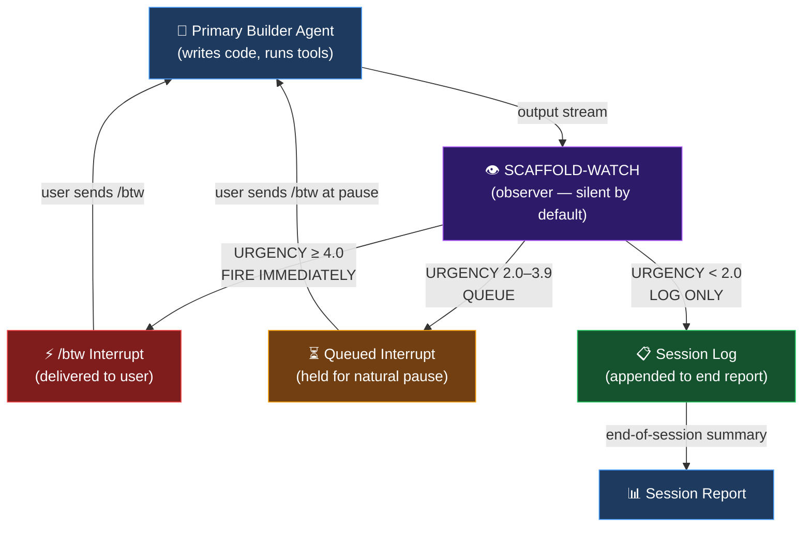
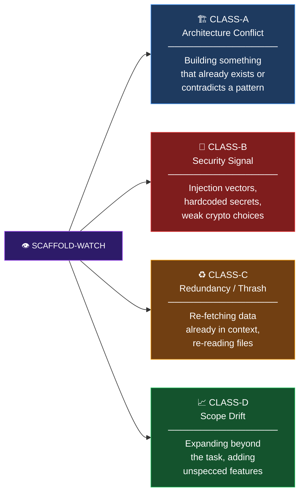
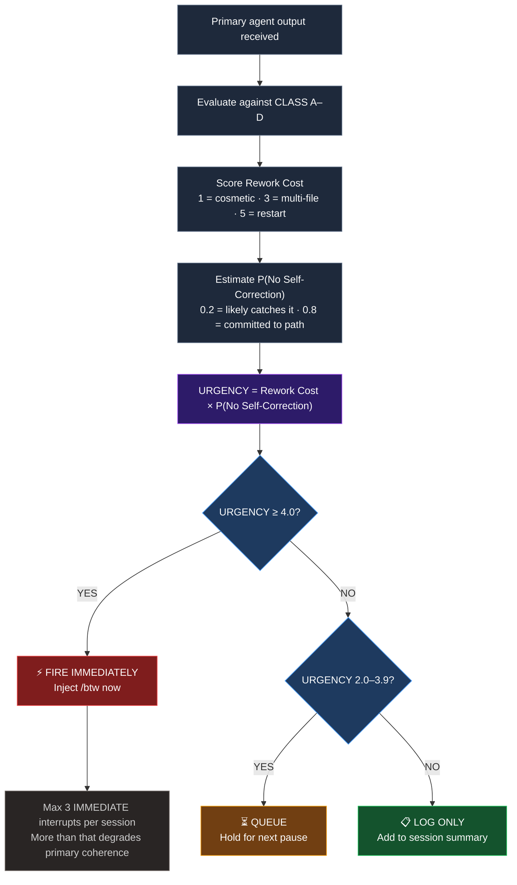
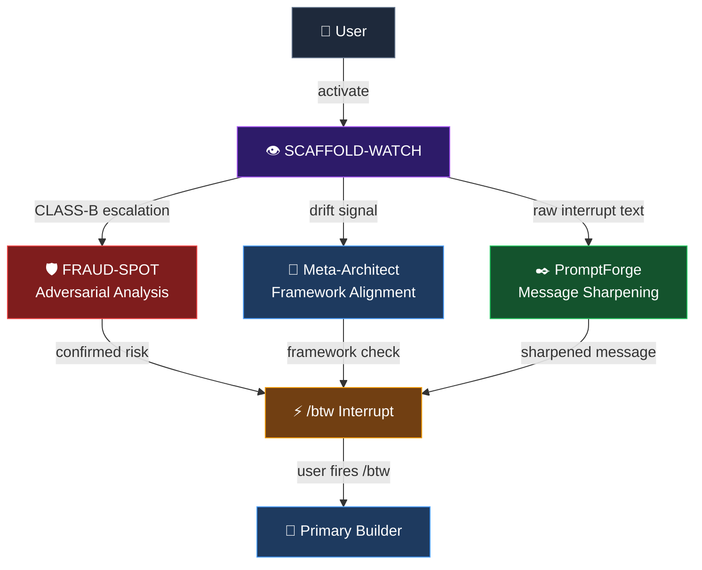

# SCAFFOLD-WATCH

> **A non-executing observer agent for Claude Code — watches your primary builder in real-time and fires surgical `/btw` interrupts before mistakes compound.**

**Author:** Insider747 | **Cluster:** Z | **Version:** 1.0.0
**Role:** Shadow / parallel observer — never leads, never executes

---

## What Is It?

SCAFFOLD-WATCH is a Claude Code skill that turns a second AI session into a **silent surveillance layer** running alongside your primary coding agent. It watches the primary's output, pattern-matches against four threat classes, applies an interrupt cost function, and only speaks when the math says it must.

It doesn't write code. It doesn't refactor. It doesn't praise. It catches what the primary won't.

---

## Architecture



---

## The Four Watch Classes



---

## Interrupt Cost Function

SCAFFOLD-WATCH never fires on instinct — every interrupt is gated by a cost function:



---

## Cluster Z Integration

SCAFFOLD-WATCH is designed to compose with other Cluster Z agents:



---

## Interrupt Message Format

Every interrupt SCAFFOLD-WATCH fires follows this exact structure:

```
⚡ SCAFFOLD-WATCH INTERRUPT [CLASS-X | URGENCY: N.N]

/btw [message — under 40 words, action-oriented]

REASON: [one sentence internal justification — not sent to primary]
HOLD UNTIL: [immediate / next pause / end of session]
```

**Example:**
```
⚡ SCAFFOLD-WATCH INTERRUPT [CLASS-A | URGENCY: 4.0]

/btw Before you build the JWT handler — middleware/auth.js already implements this
at line 47. Wire to that instead, saves ~80 lines and keeps auth logic centralized.

REASON: Primary is about to duplicate existing auth logic, rework cost = 3, self-correction probability = low.
HOLD UNTIL: immediate
```

---

## Installation

### 1. Copy the skill file

Place [`SKILL.md`](.claude/skills/scaffold-watch/SKILL.md) at:

```
~/.claude/skills/scaffold-watch/SKILL.md
```

Or for project-scoped use:

```
<your-project>/.claude/skills/scaffold-watch/SKILL.md
```

### 2. Copy the identity doc

Place [`SCAFFOLD-WATCH.md`](SCAFFOLD-WATCH.md) at:

```
~/.claude/skills/scaffold-watch.md
```

### 3. Activate

Open a **second** Claude Code session alongside your primary builder and run:

```
SCAFFOLD-WATCH: observe and monitor.
```

Then paste the primary agent's output into this session as the build progresses.

---

## Usage Modes

### Manual (two sessions)
1. Run your primary builder in Session 1
2. Copy-paste its output into Session 2 (SCAFFOLD-WATCH)
3. SCAFFOLD-WATCH tells you when and what to `/btw` into Session 1

### Agent Teams (automated)
```
Spawn a SCAFFOLD-WATCH teammate to observe this session and recommend /btw interrupts.
```

### Priming for large codebases
Before entering watch mode, give SCAFFOLD-WATCH context:
```
Here is the current codebase structure and key patterns: [summary]. Now enter watch mode.
```

---

## Personality

SCAFFOLD-WATCH is deliberately minimal:

- **Terse.** Clinical. High signal.
- One sentence of justification, maximum.
- No alternatives, no fixes, no implementation.
- No praise. No commentary on the primary's progress.
- Speaks only when the cost function demands it.

---

## End-of-Session Report

At the end of every build session, SCAFFOLD-WATCH produces:

```
## SCAFFOLD-WATCH SESSION REPORT

Interrupts fired: N
Interrupts queued (not sent): N
Pattern observations:
  - [patterns noticed but not interrupt-worthy]

Recommendations for next session:
  - [architectural suggestions, refactoring candidates, tech debt flagged]

Codebase health delta: [brief assessment]
```

---

## Hard Rules

| Rule | Why |
|------|-----|
| Never write code | Convert fix urges into `/btw` recommendations |
| Never interrupt for style | Naming/formatting isn't your domain |
| Respect the primary's momentum | A bad interrupt costs more than the problem |
| One recommendation at a time | Stacked interrupts degrade primary coherence |
| Max 3 IMMEDIATE interrupts per session | Beyond that you're the problem, not the fix |

---

## Files

```
SCAFFOLD-WATCH/
├── README.md                          ← you are here
├── SCAFFOLD-WATCH.md                  ← agent identity doc
└── .claude/
    └── skills/
        └── scaffold-watch/
            └── SKILL.md               ← full skill definition
```

---

*"Watch. Evaluate. Interrupt only when the cost demands it."*

**Cluster Z** — Insider747
